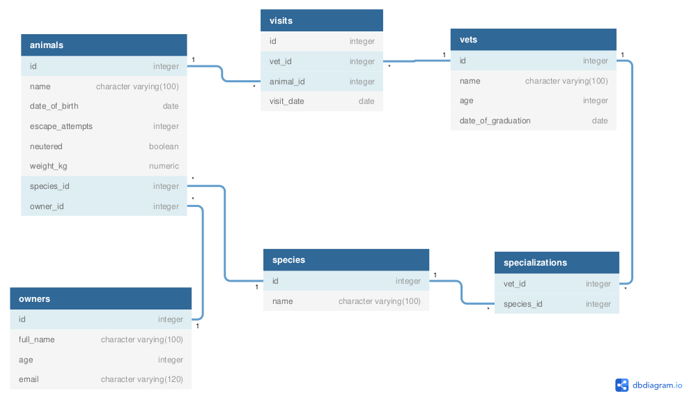

# Vet Clinic Database

This is a project that uses a relational database to create the data structure for a vet clinic. The complete database includes data about:

- Animals
- Animals' owners
- Clinic employees
- Visits

## Built With

- PostgreSQL
- VSCode
- Git & GitHub

## Author

👤 **Mouaz El Molkey**

- GitHub: [@iamouaz](https://github.com/iammouaz)
- LinkedIn: [Mouaz El Molkey](https://www.linkedin.com/in/mohammad-mouaz-molki-1368981bb/)

## 🤝 Contributing

Contributions, issues, and feature requests are welcome!

Feel free to check the [issues page](../../issues/).

## Show your support

Give a ⭐️ if you like this project!

## 📝 License

This project is [MIT](./MIT.md) licensed.